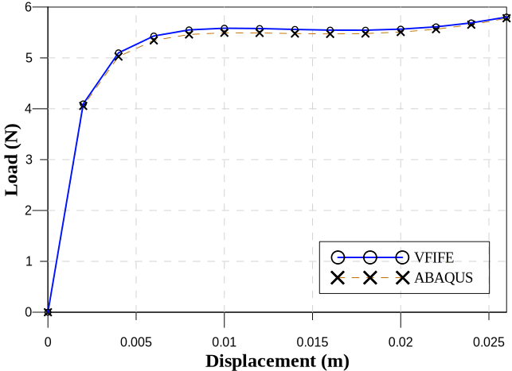

# Introduction

測試非常非常非常非常非常非常非常非常非常非常非常非常非常非常非常非常非常非常非常非常非常非常非常非常非常非常非常非常非常非常非常非常非常非常非常長的文字，沒有換行。

測試引用[@vf-two]。阿法 $\alpha$ 可以顯示在文字中嗎？

圖片 (Images)：@fig:a

{#fig:a}

方程式 (Equations)：@eq:cases

$$
\begin{cases}
x = 10
\\
y = 20
\end{cases}
$$ {#eq:cases}

表格 (Tables)：@tbl:my-news

: My news {#tbl:my-news}

| A | B |
|:---:|:--:|
| 10 | 20 |
